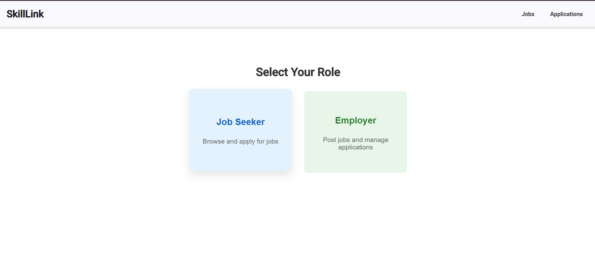

<!DOCTYPE html>
<html lang="en">
<head>
  <meta charset="UTF-8">
</head>
<body>

  <h1>💼 Job Portal</h1>
  
A full-stack web-based Job Portal where employers can post jobs and applicants can apply to them. Built using <strong>Angular 16</strong>, <strong>Node.js with TypeScript</strong>, and <strong>MySQL</strong>.

  
  

  <h2>🚀 Project Objectives</h2>
  <ul>
    <li>Allow <strong>employers</strong> to post, edit, and delete job listings.</li>
    <li>Allow <strong>applicants</strong> to browse and apply for jobs.</li>
    <li>No authentication required — open and accessible UI.</li>
  </ul>
  
  <h2>🔧 Tech Stack</h2>
  <ul>
    <li><strong>Frontend:</strong> Angular 16 + Angular Material</li>
    <li><strong>Backend:</strong> Node.js + Express + TypeScript</li>
    <li><strong>Database:</strong> MySQL</li>
    <li><strong>Hosting:</strong> Railway (Backend + DB)</li>
  </ul>
  <h2>🏠 Homepage</h2>

  <h2>🧩 Features</h2>
  <h3>🔐 User Roles</h3>
  <ul>
    <li>No login/signup required.</li>
    <li>Employers and applicants can use features directly.</li>
  </ul>

  <h3>👨‍💼 Employers Can:</h3>
  <ul>
    <li>✅ Post new job listings</li>
    <li>✅ Edit/Delete existing listings</li>
    <li>✅ View all job postings</li>
  </ul>

  
<strong>Job Posting Fields:</strong>

  <ul>
    <li>Job Title (required)</li>
    <li>Company Name (required)</li>
    <li>Location (required)</li>
    <li>Job Type (Full-time, Part-time, Contract, Internship)</li>
    <li>Salary Range (optional)</li>
    <li>Job Description (required)</li>
    <li>Application Deadline (required)</li>
  </ul>

  <h3>🧑‍💼 Applicants Can:</h3>
  <ul>
    <li>✅ Browse all job listings</li>
    <li>✅ View detailed job info</li>
    <li>✅ Apply by submitting:
      <ul>
        <li>Name (required)</li>
        <li>Email (required)</li>
      </ul>
    </li>
    <li>✅ View submitted applications</li>
  </ul>

  <h2>🖥️ Frontend - Angular</h2>
  <h3>📦 Components</h3>
  <table>
    <tr><th>Component</th><th>Description</th></tr>
    <tr><td>JobListComponent</td><td>Lists all jobs</td></tr>
    <tr><td>JobDetailsComponent</td><td>Shows detailed job info</td></tr>
    <tr><td>JobFormComponent</td><td>Add/Edit job listing form</td></tr>
    <tr><td>JobApplicationFormComponent</td><td>Form to apply for a job</td></tr>
    <tr><td>JobApplicationsListComponent</td><td>Lists all submitted applications</td></tr>
    <tr><td>JobRoleSelection</td><td>Select the Role(Applicant/Employer)</td></tr>
  </table>

  <h3>🛣️ Routes</h3>
  <table>
    <tr><th>Path</th><th>Component</th><th>Description</th></tr>
    <tr><td>/jobs</td><td>JobListComponent</td><td>View all jobs</td></tr>
    <tr><td>/jobs/new</td><td>JobFormComponent</td><td>Post a new job</td></tr>
    <tr><td>/jobs/edit/:id</td><td>JobFormComponent</td><td>Edit existing job</td></tr>
    <tr><td>/jobs/:id</td><td>JobDetailsComponent</td><td>View job details</td></tr>
    <tr><td>/jobs/:id/apply</td><td>JobApplicationFormComponent</td><td>Apply for a job</td></tr>
  </table>

  <h2>🔙 Backend - Node.js + TypeScript</h2>
  <ul>
    <li>RESTful API for Jobs & Applications</li>
    <li>Input validation & error handling</li>
    <li>MySQL for persistent storage</li>
  </ul>

  <h2>🗃️ Database Schema (MySQL)</h2>
  <h3>📄 Jobs Table</h3>
  <table>
    <tr><th>Column</th><th>Type</th><th>Constraints</th></tr>
    <tr><td>id</td><td>INT</td><td>Primary Key, Auto Increment</td></tr>
    <tr><td>job_title</td><td>VARCHAR(255)</td><td>Not Null</td></tr>
    <tr><td>company_name</td><td>VARCHAR(255)</td><td>Not Null</td></tr>
    <tr><td>location</td><td>VARCHAR(255)</td><td>Not Null</td></tr>
    <tr><td>job_type</td><td>ENUM(...)</td><td>Not Null</td></tr>
    <tr><td>salary_range</td><td>VARCHAR(255)</td><td>Optional</td></tr>
    <tr><td>job_description</td><td>TEXT</td><td>Not Null</td></tr>
    <tr><td>application_deadline</td><td>DATE</td><td>Not Null</td></tr>
    <tr><td>created_at</td><td>TIMESTAMP</td><td>Default: Current Timestamp</td></tr>
  </table>

  <h3>📄 Applications Table</h3>
  <table>
    <tr><th>Column</th><th>Type</th><th>Constraints</th></tr>
    <tr><td>id</td><td>INT</td><td>Primary Key, Auto Increment</td></tr>
    <tr><td>job_id</td><td>INT</td><td>Foreign Key → jobs(id)</td></tr>
    <tr><td>applicant_name</td><td>VARCHAR(255)</td><td>Not Null</td></tr>
    <tr><td>email</td><td>VARCHAR(255)</td><td>Not Null</td></tr>
    <tr><td>applied_at</td><td>TIMESTAMP</td><td>Default: Current Timestamp</td></tr>
  </table>

  <h2>🌐 API Endpoints</h2>
  <h3>🧾 Role-Selection API</h3>
  <table>
    <tr><th>Method</th><th>Endpoint</th><th>Description</th></tr>
    <tr><td>GET</td><td>/api/role-selection</td><td>Get Applicant Role</td></tr>
    <tr><td>GET</td><td>/api/role-selection</td><td>Get Employer Role</td></tr>
  </table>
  <h3>🧾 Job API</h3>
  <table>
    <tr><th>Method</th><th>Endpoint</th><th>Description</th></tr>
    <tr><td>GET</td><td>/api/jobs</td><td>Get all job listings</td></tr>
    <tr><td>POST</td><td>/api/jobs</td><td>Create a new job</td></tr>
    <tr><td>GET</td><td>/api/jobs/:id</td><td>Get job by ID</td></tr>
    <tr><td>PUT</td><td>/api/jobs/:id</td><td>Update job details</td></tr>
    <tr><td>DELETE</td><td>/api/jobs/:id</td><td>Delete a job listing</td></tr>
  </table>

  <h3>📬 Application API</h3>
  <table>
    <tr><th>Method</th><th>Endpoint</th><th>Description</th></tr>
    <tr><td>GET</td><td>/api/applications</td><td>Get all applications</td></tr>
    <tr><td>POST</td><td>/api/jobs/:id/apply</td><td>Apply for a job</td></tr>
    <tr><td>GET</td><td>/api/applications/:id</td><td>Get application by ID</td></tr>
  </table>
  <h2>📎 License</h2>
  
This project is open-source and free to use under the MIT License.

</body>
</html>
